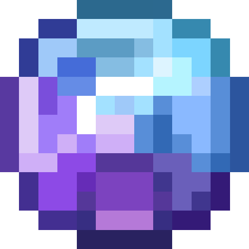
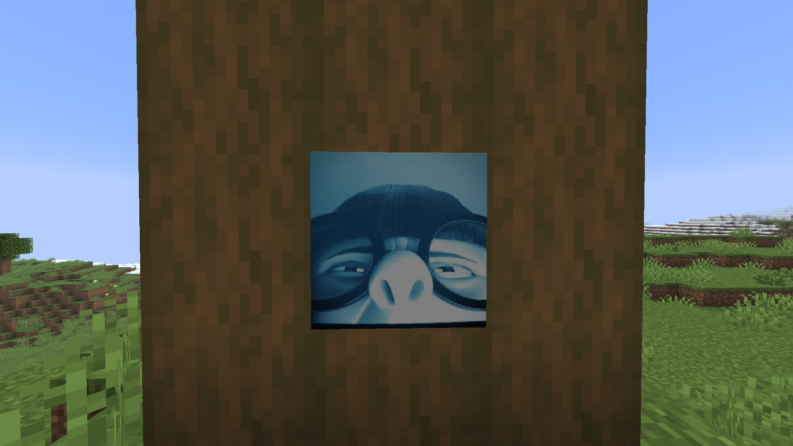
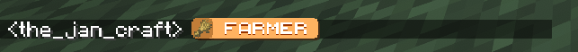
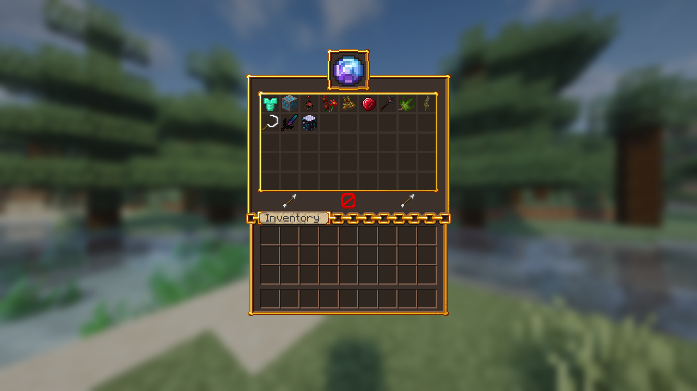
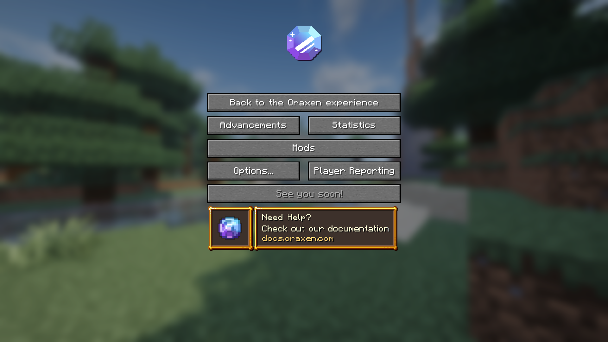

<h1 align="center">
  <br>
  
  <br>
  Oraxen
  <br>
</h1>

<h4 align="center">A Minecraft plugin for easily creating custom items, blocks, glyphs, paintings, music discs, and more.</h4>

<p align="center">
  <a href="https://www.codefactor.io/repository/github/oraxen/oraxen">
    
  </a>

  <a href="https://repo.oraxen.com/releases/io/th0rgal/oraxen/">
    
  </a>

  <a href="https://discord.gg/N7AJFJTgBS">
    
  </a>

  <a href="https://oraxen.mizius.com">
    
  </a>

  <a href="https://bstats.org/plugin/bukkit/Oraxen">
    
  </a>

  <a href="https://bstats.org/plugin/bukkit/Oraxen">
    
  </a>
</p>

## Overview

Oraxen is a Minecraft plugin that allows server owners, administrators, and developers to easily create custom content through configuration files and a simple resource pack setup.

It supports Paper (including forks) and Folia from versions 1.20.1 through 26.2.

## Features

Some of the features Oraxen provides to server owners and administrators are listed below.

### Specialties

- Built-in ViaVersion support for versions 1.21.4–26.2, with optional advanced support for versions 1.20–26.2 through MultiVersionPacks.
- Hot reloading for custom paintings and, in the future, custom music discs.
- Fast support through tickets and a team that listens to the community and considers its ideas.
- Well-organized documentation available [here](https://oraxen.mizius.com).

### Items

- Swords, pickaxes, food, shields, bows, and more.

### Blocks

- Blocks, slabs, stairs, doors, and more. Supports hot reloading and animations.


<details>
  <summary><strong>Example</strong></summary>

```yaml
example-block:
  itemname: 'Cool block'
  Mechanics:
  block:
    type: FULL # FULL, STRING, CHORUS, STAIR, SLAB, DOOR, TRAPDOOR, GRATE, BULB
    light: 15
    block-sounds:
      break-sound: block.wood.break
      place-sound: block.wood.place
    placeable:
      floor: true # Top of blocks
      wall: true  # Sides of blocks
      roof: false # Underside of blocks
      allow:
        - minecraft:grass
      disallow:
        - minecraft:dirt
    custom-variation: 5
    appearance: # Textures are also supported
      model: blocks/cool-block
    events: # Run actions when a placed block is clicked
      - click: right # BOTH, LEFT, RIGHT
        actions:
          - command: 'say "<Player> clicked this block"'
            executor: CONSOLE # PLAYER, CONSOLE, OP-PLAYER
          - message: '<green>Hi <Player>.'
    breaking: # Custom drop and breaking configuration
      - when: # When the tool is...
          - minecraft:iron_axe
          - minecraft:golden_axe
          - minecraft:diamond_axe
          - minecraft:netherite_axe # Tags are also supported through "#<tag>"
        hardness: 2 # Hardness when one of these tools is used
        drops: # Drops when one of these tools is used
          - item: crystalmush_log
            probability: 1.0
            silk-touch: false # Only drop when the tool has Silk Touch
            fortune: 1 # Percentage increase per Fortune level, where 1 equals 100%
        durability:
          remove: 1 # Remove or add durability when breaking
          add: 0
      - else: # Anything not covered by another `when` section
        hardness: 4
        drops:
          - item: example-block
            probability: 1.0
        durability:
          remove: 2 # Remove or add durability when breaking
          add: 0
````

</details>

### Paintings

* Custom paintings with support for hot reloading and animations.



<details>
  <summary><strong>Example</strong></summary>

A tutorial is available [here](https://oraxen.mizius.com/usage/tutorials/491d3).

```yaml
example-painting:
  material: PAINTING
  itemname: "<gold>Example Painting"
  Components:
    painting_variant: "oraxen:example"
```

```yaml
paintings:
  oraxen:example:
    author: the_jan_craft
    title: <red>Example Painting
    asset_id: oraxen:example # References plugins/Oraxen/pack/assets/oraxen/textures/painting/example.png
    width: 1
    height: 1
```

</details>

### Sounds and Music Discs

* Custom sounds and music discs.


<details>
  <summary><strong>Example</strong></summary>

Tutorials are available [here](https://oraxen.mizius.com/usage/tutorials/d31l5f) and [here](https://oraxen.mizius.com/usage/tutorials/23ho7).

```yaml
example-disc:
  material: MUSIC_DISC_13
  itemname: "<gold>Example Disc"
  Pack:
    model: discs/example
  Components:
    jukebox_playable:
      show_in_tooltip: true
      song_key: "oraxen:example"
```

```yaml
sounds:
  - id: oraxen:example
    category: records
    sound: discs/example.ogg # References plugins/Oraxen/pack/sounds/discs/example.ogg
    stream: true
    subtitle: "Example Song"
    jukebox:
      description: "<gold>Example <yellow>Song</yellow></gold>"
      duration: 20s
```

</details>

### Glyphs and Animated Glyphs

* Animated and static emojis, ranks, GUIs, escape menus, and more.



<details>
  <summary><strong>More Images</strong></summary>





</details>

### Armor

* Custom armor and elytra.


### Recipes

* Crafting, smelting, blasting, smoking, and stonecutting recipes, with an easy-to-use in-game GUI editor.

### Text Effects

* Colored text animations.

## Building
See https://oraxen.mizius.com/developers/compiling.

## Contributing
See https://oraxen.mizius.com/developers/contributing.

## License

Read the full license in [`LICENSE.md`](LICENSE.md).

Oraxen is a paid plugin. You must purchase a license from [SpigotMC](https://www.spigotmc.org/resources/oraxen.72448/) or [BuiltByBit](https://builtbybit.com/resources/oraxen-custom-items-blocks-more.16594/) to use it. Public forks are permitted for contributing pull requests, provided that you comply with the license. Do not redistribute compiled builds or source code, whether modified or unmodified, except as permitted by the license.